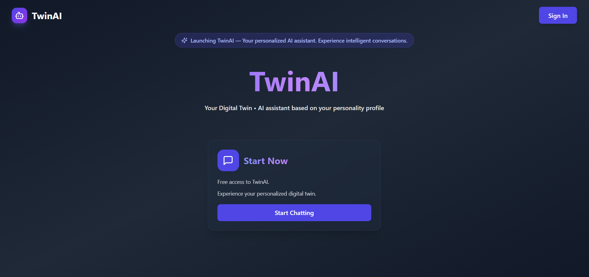
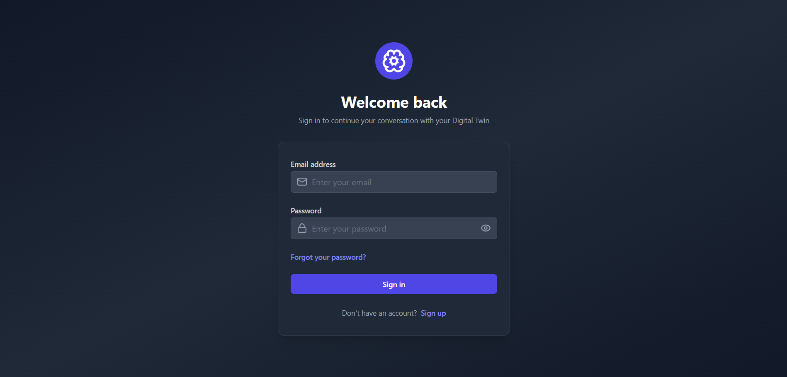
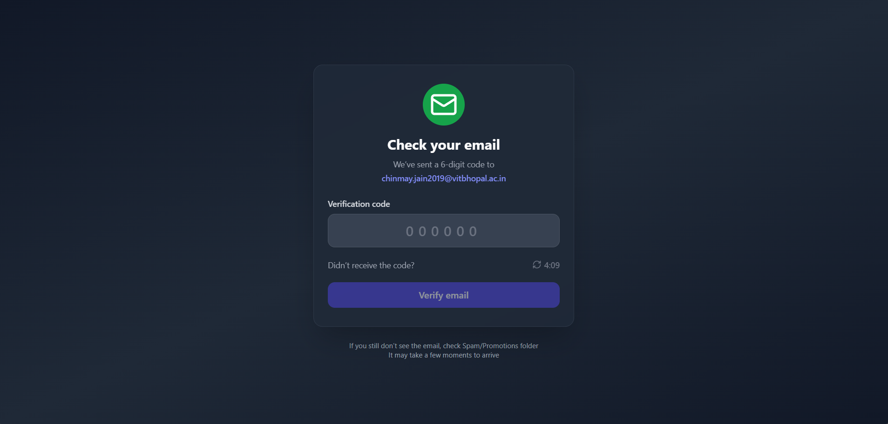
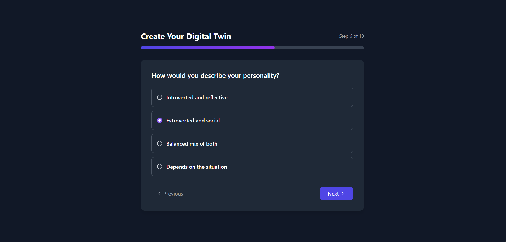
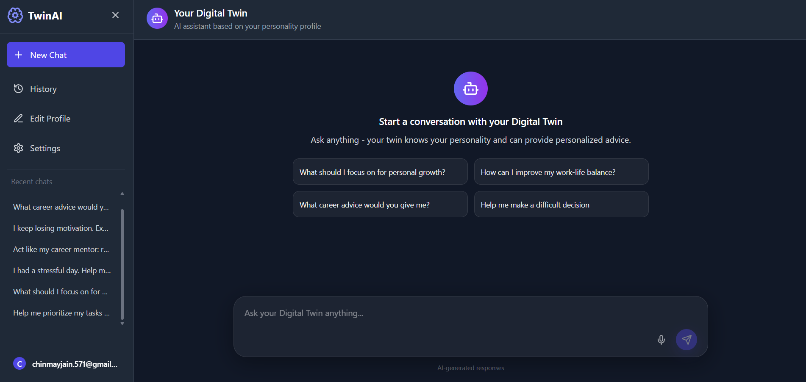
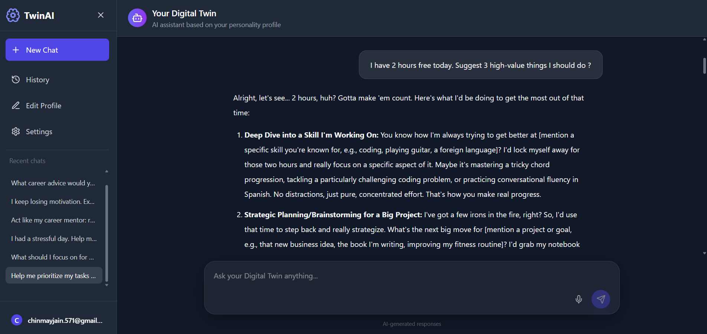
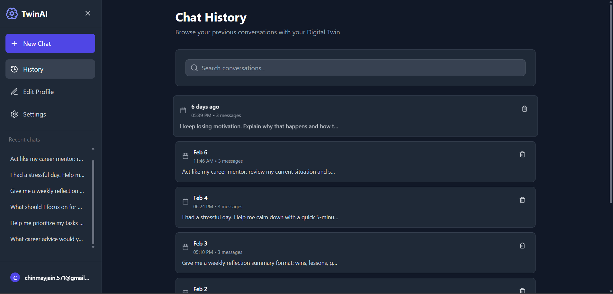
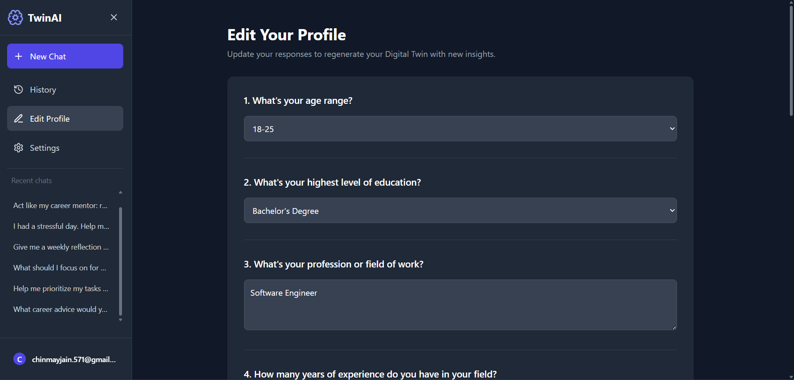
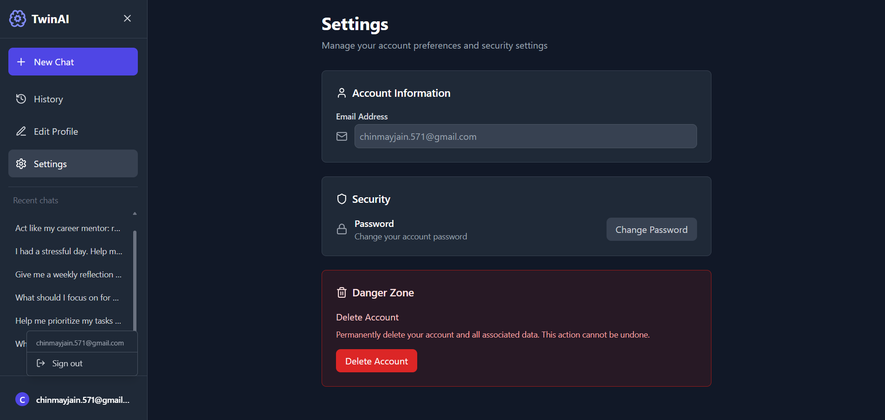
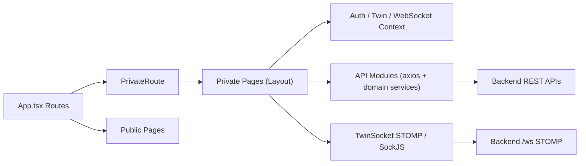

# `digital-twin-ai-frontend`

Frontend for TwinAI — a React + TypeScript application that guides users through onboarding, authentication, verification, profile creation, and personalized AI conversations powered by their Digital Twin profile.

---

## Table of Contents

1. [Project Overview](#1-project-overview)
2. [Demo](#2-demo)
3. [Screenshots](#3-screenshots)
4. [Key Features](#4-key-features)
5. [Tech Stack](#5-tech-stack)
6. [Product / User Flow](#6-product--user-flow)
7. [Architecture / Frontend Design](#7-architecture--frontend-design)
8. [Module Breakdown](#8-module-breakdown)
9. [Routing and Access Control](#9-routing-and-access-control)
10. [State Management and Data Flow](#10-state-management-and-data-flow)
11. [API Integration](#11-api-integration)
12. [UI/UX Highlights](#12-uiux-highlights)
13. [Environment Variables](#13-environment-variables)
14. [Getting Started / Local Setup](#14-getting-started--local-setup)
15. [Build and Deployment](#15-build-and-deployment)
16. [Engineering Highlights](#16-engineering-highlights)
17. [Future Enhancements](#17-future-enhancements)
18. [Author / Ownership](#18-author--ownership)

---

## 1. Project Overview

`digital-twin-ai-frontend` is a React + TypeScript single-page application for the TwinAI product. It provides the complete user-facing journey: onboarding, authentication, email verification, digital twin profile creation, personalized AI chat, chat history management, profile updates, and account settings.

The main problem this frontend solves is usability for a multi-step AI personalization workflow. Instead of exposing users to backend complexity, the UI guides them through a clear path from account creation to a profile-aware conversational assistant.

From a user experience perspective, the “Digital Twin AI” concept is implemented as a stateful product flow: users define themselves through a structured profile builder, review their generated twin summary, and then chat in a dedicated workspace where responses are streamed in real time over WebSocket.

This frontend also works well as an interview-ready product demo because it showcases production-style routing, guarded access flows, context-driven state, API service layering, and real-time interaction patterns.

---

## 2. Demo

### Chat Flow Demo


---

## 3. Screenshots

### Landing Page

*Marketing entry screen with a clear “Start Chatting” CTA.*

### Sign In / Sign Up

*Unified auth screen with login/register flow.*

### Email Verification

*OTP verification UI with resend timer.*

### Digital Twin Profile Builder

*Step-based questionnaire for twin profile generation.*

### Chat Workspace (Empty State)

*Prompt suggestions, recent chats, and message composer.*

### Conversation View

*Rendered conversation thread with markdown AI output.*

### Chat History

*Searchable conversation list with delete action.*

### Edit Profile

*Editable questionnaire answers with regenerate action.*

### Settings (Optional)

*Account info, password change entry point, and account deletion.*

---

## 4. Key Features

- Public landing page with signed-in shortcut behavior
- Authentication flow (register + login) with JWT storage
- Email verification flow and forgot-password OTP flow
- Password reset UX for both authenticated and forgot-password users
- Protected route system for authenticated and verified users
- Profile completion gating before chat workspace access
- Multi-step digital twin profile builder with question-type aware inputs
- Profile summary review screen before chat usage
- Real-time twin chat via STOMP/SockJS WebSocket stream
- Incremental streaming message rendering (`DELTA` / `DONE` events)
- Chat session support with dynamic `/chat/:sessionId` routing
- Conversation history with search, pagination-backed loading, and deletion
- Edit profile flow with change detection and profile regeneration
- Settings screen with account info, password change, and delete account action
- Speech-to-text input support using the browser Web Speech API
- Shared layout with recent chats panel and user menu
- Loading, empty, error, and confirmation states across major screens

---

## 5. Tech Stack

- React 19
- TypeScript
- React Router (`react-router-dom`)
- Axios (HTTP client + interceptor)
- Context API (Auth, Twin state, WebSocket session)
- STOMP over SockJS (`@stomp/stompjs`, `sockjs-client`)
- Tailwind CSS
- Lucide React (icons)
- React Hot Toast (notifications)
- JWT decode (`jwt-decode`)
- React Markdown + `remark-gfm` (AI response rendering)
- CRA toolchain (`react-scripts`)
- Docker (multi-stage build)
- Nginx (static hosting + `/api` and `/ws` reverse proxy)

---

## 6. Product / User Flow

1. User lands on `/` and clicks **Start Chatting**.
2. If unauthenticated, user goes to `/auth` for login or registration.
3. Unverified users are routed to verification request / OTP flow (`/user/email`, `/account/verify`).
4. After verification, private routes open and the app checks for an existing profile summary.
5. If no profile exists, user is guided to `/generate-profile` (step-by-step questionnaire).
6. User reviews the generated summary on `/profile-summary`.
7. User enters the chat workspace (`/chat` or `/chat/:sessionId`) and interacts with TwinAI.
8. User can browse or delete conversations in `/history`.
9. User can update their profile in `/profile-edit` and manage the account in `/settings`.

---

## 7. Architecture / Frontend Design

The app uses feature-oriented pages, reusable UI components, context-based state, and service modules for API/WebSocket integration.

- **Pages**: product screens under `src/pages`
- **Components**: shared building blocks such as layout, loaders, and reusable UI
- **Routes**: centralized route map in `App.tsx`
- **Context**: global auth, twin, and websocket providers
- **API Layer**: domain-specific modules under `src/api`
- **Chat Hooks/Services**: streaming behavior split into reusable hooks, services, and types
- **Utils**: token decode and API error normalization helpers



---

## 8. Module Breakdown

### Core App

- `src/App.tsx` — route definitions, lazy loading, and suspense fallback
- `src/routes/PrivateRoute.tsx` — guard for authenticated and verified users
- `src/context/GlobalContextProvider.tsx` — provider composition order (`AuthProvider` → `WebSocketProvider` → `TwinProvider`)

### State Contexts

- `src/context/AuthContext.tsx` — token bootstrap, user session state, logout
- `src/context/TwinContext.tsx` — profile answers and profile summary state
- `src/context/WebSocketContext.tsx` — singleton socket lifecycle, connection readiness, and event subscription fan-out

### API Services

- `src/api/axios.ts` — base axios client and JWT header interceptor
- `src/api/authApi.ts` — auth, account verification, and account deletion endpoints
- `src/api/passwordResetApi.ts` — forgot-password OTP and reset flows
- `src/api/profileApi.ts` — profile questions, profile creation/update, and summary retrieval
- `src/api/chatApi.ts` — session list, message history, and session deletion

### Main Screens

- `src/pages/Home.tsx`
- `src/pages/auth/*`
- `src/pages/profile/*`
- `src/pages/chat/*`
- `src/pages/History.tsx`
- `src/pages/Settings.tsx`

### Chat Submodules

- `src/pages/chat/services/TwinSocket.ts` — STOMP client wiring
- `src/pages/chat/hooks/useMessageHandler.ts` — stream event handling
- `src/pages/chat/hooks/UseSpeechRecognition.ts` — browser speech-to-text integration
- `src/pages/chat/types/TwinTypes.ts` — shared websocket event/request types
- `src/pages/chat/utils/messageUtils.ts` — optimistic message helpers and token utilities

---

## 9. Routing and Access Control

### Public Routes

- `/` — Home
- `/auth` — Login / Register
- `/change/password` — Password change / reset screen depending on navigation state
- `/user/email` — Request verification/reset email flow
- `/account/verify` — OTP verification screen

### Private Routes

- `/generate-profile`
- `/profile-summary`
- `/chat`
- `/chat/:sessionId`
- `/history`
- `/profile-edit`
- `/settings`

### Access Rules

- `PrivateRoute` checks:
  - user exists (authentication required)
  - user is verified (verification required)
- `Layout` performs the profile-summary check and redirects to `/generate-profile` if profile data is missing

---

## 10. State Management and Data Flow

This app uses **React Context + local component state**.

- `AuthContext`
  - stores `user` parsed from JWT
  - controls logout and session reset
- `TwinContext`
  - stores profile answers and generated summary for profile/chat flows
- `WebSocketContext`
  - maintains one shared socket instance per logged-in user
  - exposes `isConnected`, `sendChat`, and `subscribe`

### Data Flow Pattern

1. A UI event triggers a page-level action.
2. The action calls an API service or sends a WebSocket event.
3. The result updates local state and/or shared context.
4. Route navigation and toasts provide user feedback.

---

## 11. API Integration

The frontend talks to the backend through domain service modules.

### Auth / Account

- `login`
- `register`
- `requestAccountVerificationOtp`
- `verifyAccountVerificationOtp`
- `deleteAccount`

### Password

- `requestPasswordResetOtp`
- `verifyPasswordResetOtp`
- `resetForgottenPassword`
- `resetAuthenticatedUserPassword`

### Profile

- `getProfileQuestion`
- `createProfileSummary`
- `updateProfileSummary`
- `getProfileSummary`

### Chat

- `getAllChatSessions`
- `getChatHistory`
- `deleteChatSession`

### Real-Time Chat

- STOMP publish to `/app/twin.chat`
- Subscribe to `/user/queue/twin.events`

### Client Setup

- `axios` base URL comes from `REACT_APP_API_URL` (fallback `/api`)
- WebSocket URL comes from `REACT_APP_WS_URL` (fallback `/ws`)
- JWT token is read from `localStorage` and attached by interceptor for non-public API calls

---

## 12. UI/UX Highlights

- Cohesive dark-first visual identity with gradient accents
- Clear onboarding from landing to verification to profile creation
- Step-based profile form with progress bar and question-type-specific controls
- Chat-first workspace with suggested prompts for zero-state engagement
- Streaming conversation rendering and markdown display for rich responses
- Sidebar with recent sessions to improve chat continuity
- Searchable history with optimistic deletion and rollback behavior
- Dedicated account safety actions (password update + delete confirmation)

---

## 13. Environment Variables

| Variable | Required | Purpose | Example |
|---|---|---|---|
| `REACT_APP_API_URL` | Yes (recommended) | Base URL for REST API client | `http://localhost:8080/api` |
| `REACT_APP_WS_URL` | Yes (recommended) | WebSocket/STOMP endpoint URL | `http://localhost:8080/ws` |

Notes:
- If unset, the frontend defaults to relative paths `/api` and `/ws`
- `.env.local` exists in the repo with local development values

---

## 14. Getting Started / Local Setup

### Prerequisites

- Node.js 18+ (Node 20 recommended)
- npm
- Running backend service compatible with the expected APIs and WebSocket endpoints

### Install and Run

```bash
git clone <your-repo-url>
cd digital-twin-ai-frontend
npm install
```

Create or update local env:

```bash
# .env.local
REACT_APP_API_URL=http://localhost:8080/api
REACT_APP_WS_URL=http://localhost:8080/ws
```

Start the dev server:

```bash
npm start
```

Build the production bundle:

```bash
npm run build
```

Run tests (CRA default):

```bash
npm test
```

Notes:
- No dedicated `lint` script is currently defined in `package.json`

---

## 15. Build and Deployment

Currently implemented deployment assets:

- **CRA build output** via `react-scripts build` (outputs to `build/`)
- **Docker multi-stage build**
  - Stage 1: Node image builds static assets
  - Stage 2: Nginx image serves built files
- **Nginx template-based runtime proxying**
  - `/api` proxied to `${BACKEND_UPSTREAM}/api`
  - `/ws` proxied to `${BACKEND_UPSTREAM}/ws`

Dockerfile default:

- `BACKEND_UPSTREAM=backend:8080`

This allows frontend and backend composition behind one Nginx origin.

### Docker Hub

Prebuilt Docker image for the frontend is available on Docker Hub:

- Docker Hub: - [Frontend Image on Docker Hub](https://hub.docker.com/repository/docker/chinmay189jain/digital-twin-ai-frontend)

Pull the image:

```bash
docker pull chinmay189jain/digital-twin-ai-frontend:latest
```

---

## 16. Engineering Highlights

This is a strong interview-facing frontend project because it demonstrates:

- multi-step onboarding and gated access UX
- authentication-aware route protection and session bootstrap
- context-driven state modeling for auth, profile, and real-time messaging
- real-time AI chat integration over STOMP/SockJS
- service-layer API design with reusable domain modules
- practical UI states: loading, empty, error, optimistic update rollback
- product-oriented dashboard layout with session continuity and account controls
- deploy-ready packaging with Docker and Nginx reverse proxy

---

## 17. Future Enhancements

- Add robust automated tests for route guards, API states, and chat event flows
- Improve mobile-first behavior in dense workspace screens
- Fix and harden API interceptor public-path matching edge cases
- Add accessibility improvements (ARIA coverage, contrast, keyboard navigation audits)
- Add explicit reconnect/backoff and network-state indicators in chat UI
- Add analytics / telemetry hooks for key product funnels
- Add optional theme controls (currently dark styling is primary)

---

## 18. Author / Ownership

- **Author**: `CHINMAY JAIN`
- **Project**: `digital-twin-ai-frontend`
- **Ownership**: Maintained by the project author and contributors in this repository
